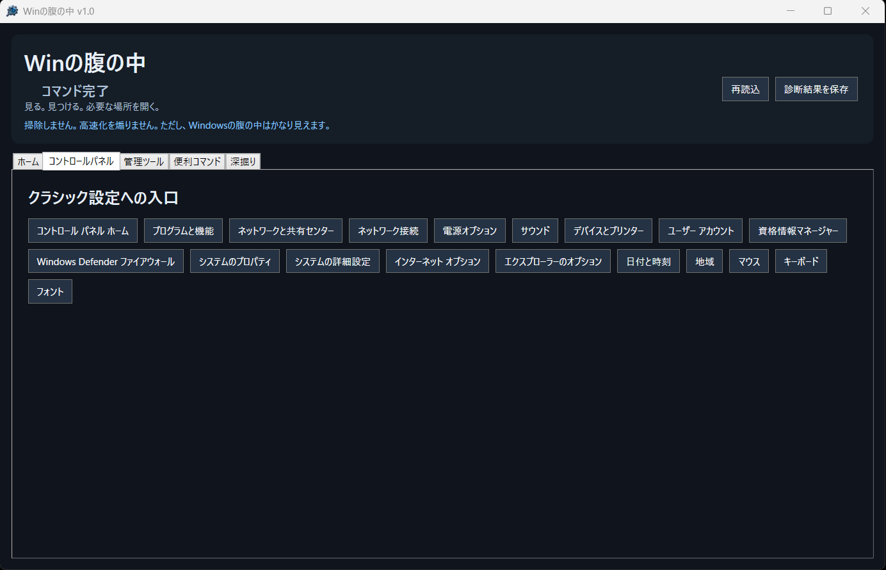
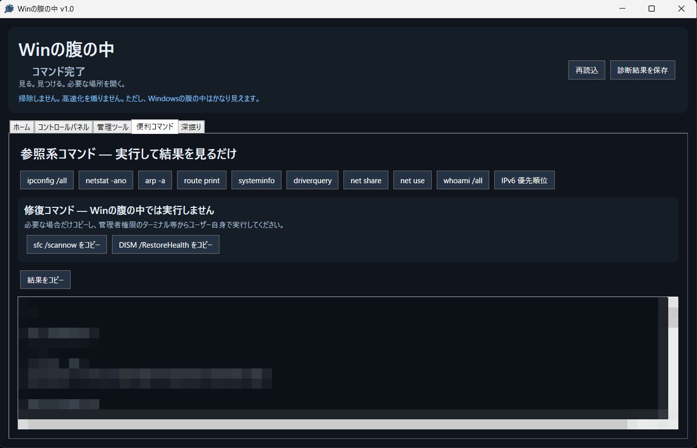
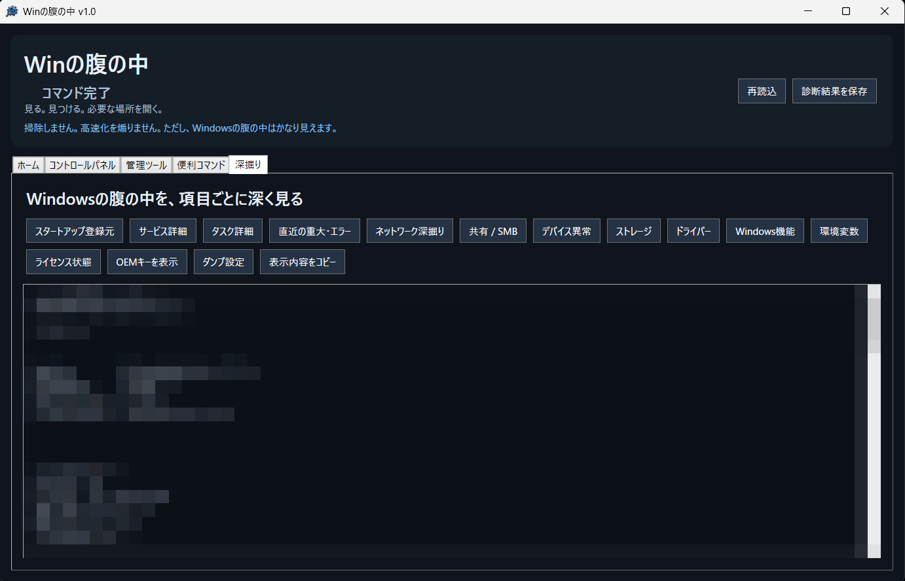

# Winの腹の中

**見る。見つける。必要な場所を開く。**

Windows PC の状態確認やトラブル切り分けに使う情報、設定画面、標準コマンドをひとつにまとめた参照・診断ツールです。

「Windowsのどこを見ればいいんだっけ？」を少し減らすことを目的に作りました。

> **掃除しません。高速化を煽りません。**  
> ただし、Windowsの腹の中はかなり見えます。

## 主な機能

- PC / Windows の基本情報を一覧表示
- ネットワーク情報の確認
- セキュリティ状態の確認
- ストレージ / デバイス状態の確認
- コントロールパネル各項目へのショートカット
- Windows 管理ツールへのショートカット
- 標準コマンドの実行と結果表示
- スタートアップ登録元の確認
- サービス / タスクの詳細確認
- 直近の重大エラー確認
- ネットワークの深掘り
- 共有 / SMB 情報の確認
- デバイス異常候補の確認
- ドライバー / Windows機能 / 環境変数などの確認
- 診断結果の保存

## スクリーンショット

### コントロールパネル

### 便利コマンド

### 深掘り

※ スクリーンショット内のPC固有情報・ユーザー情報などは公開用に加工しています。

## 便利コマンド

Windows標準の参照系コマンドを、ボタンから実行して結果を確認できます。

例：

- `ipconfig /all`
- `netstat -ano`
- `arp -a`
- `route print`
- `systeminfo`
- `driverquery`
- `net share`
- `net use`
- `whoami /all`
- IPv6 優先順位

修復系コマンドについては、安全のため **Winの腹の中から自動実行しません。**

必要な場合のみコマンドをコピーし、ユーザー自身が管理者権限のターミナル等から実行する方式です。

## 深掘り

通常のWindows設定画面だけでは確認しにくい情報を、項目ごとに表示できます。

スタートアップ、サービス、タスク、重大エラー、ネットワーク、SMB、デバイス、ストレージ、ドライバーなど、トラブル切り分け時に確認したい情報をまとめています。

## ダウンロード

実行ファイルは GitHub の **Releases** からダウンロードできます。

配布ZIPを展開し、`WinNoHara.exe` を実行してください。

インストール作業は不要です。

## 動作環境

- Windows 11
- PowerShell 5.1 以降

Windowsの環境・権限・構成によって、一部の情報を取得できない場合があります。

## 注意事項

本ソフトは、Windowsの状態確認とトラブル切り分けを補助するためのツールです。

基本的に情報の参照とWindows標準機能への入口を提供します。

表示された情報やコマンドの実行結果を第三者へ共有する場合は、ユーザー名、PC名、IPアドレス、SID、プロダクトキー関連情報などが含まれていないか確認してください。

特に「深掘り」の表示内容や保存した診断結果を公開する場合はご注意ください。

## ソースコード

PowerShellで作成しています。

リポジトリにはソースコードとEXE作成用のビルドファイルを公開しています。

## Version

**Winの腹の中 v1.0**

## Author

**morhirc**

---

見る。見つける。必要な場所を開く。

Windowsのトラブル時に、  
「あれ、どこを見るんだっけ？」を少し減らせれば幸いです。
